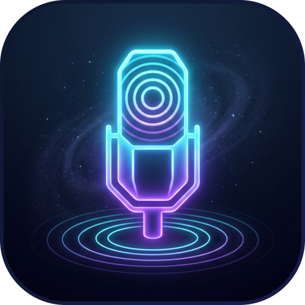

# VoxFab AI 🎙️✨

**Speak into Existence.** VoxFab AI is a powerful, glassmorphic desktop writing assistant that brings system-wide voice-to-text and AI-powered text refinement to your fingertips.



## ✨ Features

- 🎙️ **System-wide Dictation**: Press `Ctrl+Shift+Space` (or `⌘⇧Space`) to record audio and have it typed directly into any active application.
- 🤖 **AI Writing Assistant**: Highlight any text and press `Ctrl+Shift+E` (`⌘⇧E`) to fix grammar, change tone, summarize, or expand your writing using GPT-4.
- 🖼️ **OCR capabilities**: Extract text from images or screen regions and process it with AI.
- 🔘 **Mini FAB mode**: A sleek, floating action button that stays out of your way but provides quick access to core features.
- 🔒 **Privacy Focused**: Use local Whisper engines for transcription or connect your own OpenAI API key for maximum performance.
- 🎨 **Beautiful UI**: Modern glassmorphic design that feels native on Windows and macOS.

## 🚀 Getting Started

### Prerequisites
- [Node.js](https://nodejs.org/) (v18 or higher recommended)
- [npm](https://www.npmjs.com/)

### Installation

1. **Clone the repository:**
   ```bash
   git clone https://github.com/YOUR_USERNAME/voxfab-ai.git
   cd voxfab-ai
   ```

2. **Install dependencies:**
   ```bash
   npm install
   ```

3. **Run the application:**
   ```bash
   npm start
   ```

## ⚙️ Configuration

VoxFab AI allows you to choose your speech-to-text engine in the Settings panel:
- **Local Whisper**: Runs entirely on your machine (requires `@huggingface/transformers`).
- **OpenAI Whisper**: High accuracy via API (requires an OpenAI API Key).
- **Google Cloud Speech**: Another cloud option for transcription.

## 📄 License

This project is licensed under the **Creative Commons Attribution-NonCommercial-ShareAlike 4.0 International (CC BY-NC-SA 4.0)**.

- **Attribution**: You must give appropriate credit.
- **Non-Commercial**: You may not use the material for commercial purposes.
- **ShareAlike**: If you remix, transform, or build upon the material, you must distribute your contributions under the same license.

For commercial licensing inquiries, please contact the author.

---
vibe-coded by [Ilya Tsuprun](https://www.linkedin.com/in/ilya-tsuprun) 🤠
