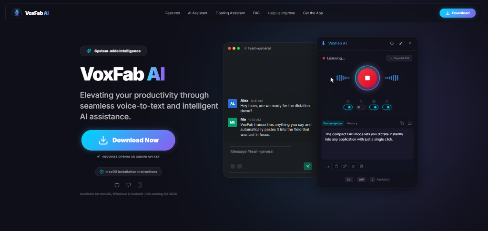
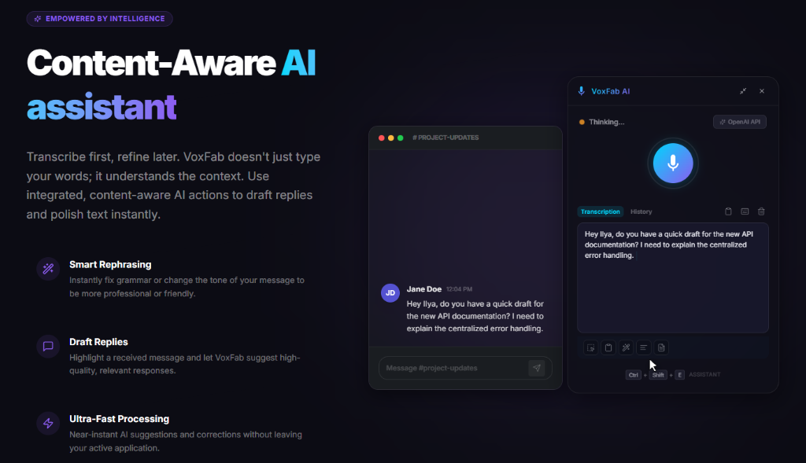
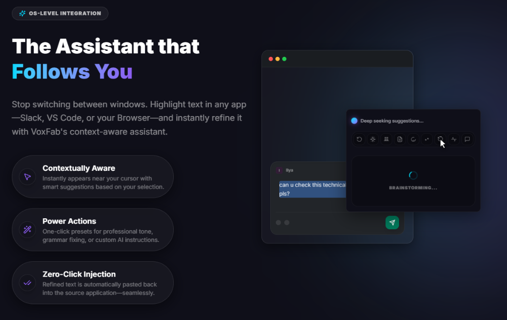
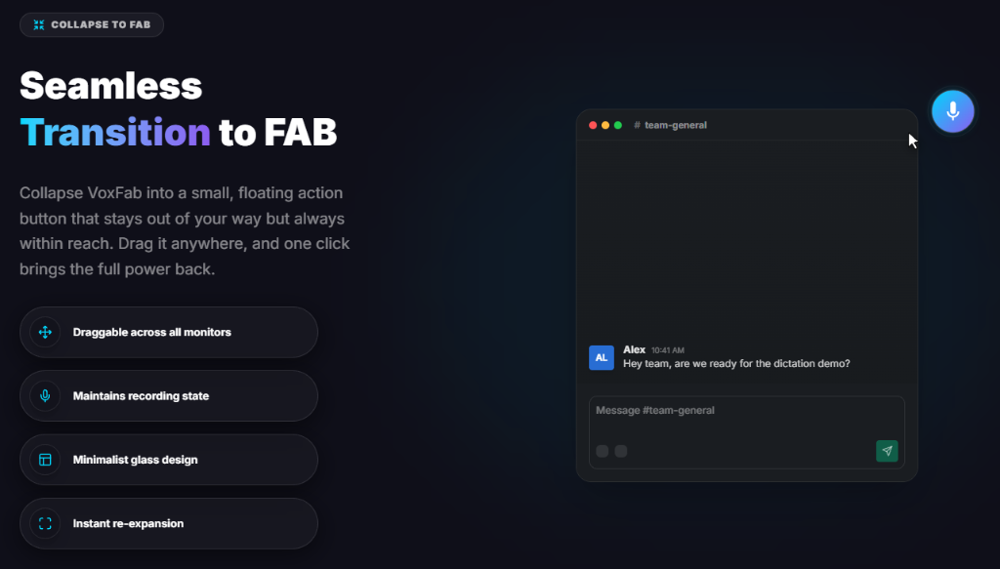

# VoxFab AI 🎙️✨

**Speak into Existence.** VoxFab AI is a super-simple, high-performance dictation productivity tool. Unlike other programs that try to be everything at once, VoxFab focuses on doing exactly one thing perfectly: lightning-fast voice-to-text with a sleek AI assistance overlay to boost your productivity. No bloat, no distractions—just pure speed for your workflow.

[](https://voxfab.app/)
[](LICENSE)



## 📥 Download

Get the latest ready-to-use version of VoxFab AI. No build steps required.

[](https://drive.proton.me/urls/KNW4V68W3C#N-LUlNjFri86)
[](https://drive.proton.me/urls/KNW4V68W3C#N-LUlNjFri86)

## ✨ Features


### 🎙️ System-wide Dictation
Press `Ctrl+Shift+Space` (or `⌘⇧Space`) to record audio and have it typed directly into any active application. VoxFab transcribes anything you say and automatically pastes it into the field that was last in focus.



### 🤖 AI Writing Assistant
Highlight any text and press `Ctrl+Shift+E` (`⌘⇧E`) to fix grammar, change tone, summarize, or expand your writing using GPT-4. Stop switching between windows; refine text instantly within Slack, VS Code, or your Browser.



### 🖼️ OCR Capabilities
Extract text from images or screen regions and process it with AI. Powerful for capturing information from videos, non-selectable PDFs, or legacy applications.

### 🔘 Mini FAB Mode
Collapse VoxFab into a small, floating action button that stays out of your way but always within reach. Drag it anywhere, and one click brings the full power back.



### 🔒 Privacy Focused
Use local Whisper engines for privacy or connect your own OpenAI API key for maximum accuracy and cloud features.

## 🚀 Getting Started

### Prerequisites
- [Node.js](https://nodejs.org/) (v18 or higher recommended)
- [npm](https://www.npmjs.com/)

### Installation

1. **Clone the repository:**
   ```bash
   git clone https://github.com/icelanderus/VoxFab-AI.git
   cd VoxFab-AI
   ```

2. **Install dependencies:**
   ```bash
   npm install
   ```

3. **Run the application:**
   ```bash
   npm start
   ```

## 📄 License

This project is licensed under the **Creative Commons Attribution-NonCommercial-ShareAlike 4.0 International (CC BY-NC-SA 4.0)**.

- **Attribution**: You must give appropriate credit.
- **Non-Commercial**: You may not use the material for commercial purposes.
- **ShareAlike**: If you remix, transform, or build upon the material, you must distribute your contributions under the same license.

For commercial licensing inquiries, please contact the author.

---
vibe-coded by [Ilya Tsuprun](https://www.linkedin.com/in/ilya-tsuprun) 🤠
